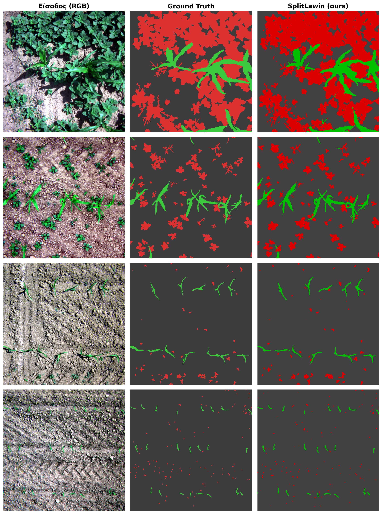
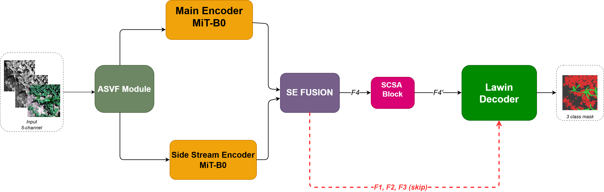

# Efficient Multispectral Crop–Weed Segmentation with Lightweight Vision Transformers

Semantic segmentation of **crop vs. weed vs. background** in multispectral UAV imagery,
built for **precision agriculture** — enabling site-specific weed control that cuts herbicide use.

This repository contains my **diploma thesis** work (Electrical & Computer Engineering,
Democritus University of Thrace, 2026). It **extends** the LWViTs / SplitLawin architecture and
applies it to the **WeedsGalore 2025** benchmark with two integrated attention modules, a new
loss formulation, a spectral-channel strategy, and an extensive ablation study.

> **Built on prior work — full credit.** This project extends **LWViTs / SplitLawin**
> (*Castellano et al., "Weed mapping in multispectral drone imagery using lightweight vision
> transformers", Neurocomputing 2023*; reference implementation by
> [@pasqualedem](https://github.com/pasqualedem/LWViTs-for-weedmapping), on the
> [`ezdl`](https://github.com/pasqualedem/ezdl) framework). The base architecture and training
> framework are their work. On top of that base, my thesis contributes two proposed modules
> (**ASVF** and **Bottleneck-SCSA**), a new loss, a spectral-channel strategy, the WeedsGalore port,
> and an extensive ablation study — all visible as the commit history on top of the original.
> Honest attribution of the building blocks: the **SCSA** attention *mechanism* is due to
> *Si et al.*; my contribution there is its bottleneck integration. The **ASVF** module is my own
> design, using channel attention inspired by *Squeeze-and-Excitation* (Hu et al.) and spatial
> attention in the style of *CBAM* (Woo et al.), guided by the NDVI vegetation index.



*Qualitative results on the WeedsGalore test set (thesis Figure 7.1). Columns: input (RGB) · ground
truth · SplitLawin (ours). Green = crop (maize), red = weed, dark = background.*

---

## Why this matters

Weeds reduce crop yield significantly. Instead of spraying an entire field uniformly, a model that
segments *weeds* at the pixel level lets autonomous drones/tractors spray **only where needed** —
less chemical use, lower cost, better yield. The core ML challenge is **extreme class imbalance** on
**multispectral** (5-band) aerial imagery: in the WeedsGalore training pixels the split is roughly
**~90 % background, ~7 % crop, ~3 % weed** — the weed class, the most important one, is by far the
rarest.

**Dataset:** [WeedsGalore](https://github.com/GFZ/weedsgalore) (Celikkan et al., WACV 2025) —
156 annotated 600×600 patches (104 train / 26 val / 26 test), 5 spectral bands (Blue, Green, Red,
Red-Edge, NIR) from a MicaSense RedEdge sensor over maize (*Zea mays*), 3 classes
(background / crop / weed; the 9 weed species are merged into a single "weed" class).

---

## My contributions (thesis)

| # | Contribution | What it is |
|---|---|---|
| 1 | **ASVF input module** *(my own module)* | *Adaptive Spectral-Vegetation Fusion* — computes NDVI from the NIR & Red bands and adaptively fuses it with the raw spectral input through channel attention (inspired by Squeeze-and-Excitation) and spatial attention (in the style of CBAM), balanced by a learnable parameter α (initialised at 0.5, converging to ≈0.45–0.55). Adds only ~3k params (<0.1% of the model). NDVI beat NDRE, OSAVI, MSAVI and dual-index guidance in ablation. |
| 2 | **Bottleneck-SCSA integration** | Places the *Spatial-Channel Synergistic Attention* mechanism (**Si et al.**) on the deepest encoder feature (F4) only — my contribution is this bottleneck integration into the SplitLawin pipeline (~80k params, ~1.5%). Ablation showed single-level (F4) placement clearly beats multi-level "attention everywhere". |
| 3 | **Loss engineering** | A **combined Focal-Tversky + Lovász (50/50)** loss for the extreme imbalance, with a weighting sweep (best: 50/50) and Focal-Tversky parameters α = 0.4, β = 0.6, γ = 4/3. This single change contributed **+0.040 mIoU** over Cross-Entropy — more than all architectural additions combined. |
| 4 | **Spectral channel strategy** | Systematic study of input band arrangements; best = **CIR (NIR,G,R) main stream + Blue & Red-Edge side stream** (same 5 bands as the RGB+RE+NIR arrangement, but re-assigned across the two branches for +0.01 mIoU) — a vegetation-aware inversion of the original RGB-main design. |
| 5 | **WeedsGalore adaptation** | Ported the whole pipeline (data loading, preprocessing, configs) to the WeedsGalore 2025 dataset. |
| 6 | **Rigorous ablation study** | ~40 experiments across 8 ablation tables, **3-seed** statistical validation (seeds 42/43/44), and documented **negative / instructive findings** (below). |

### Methodological rigor — instructive negative findings

Reporting what *didn't* work is part of honest science. All values below are from the thesis
ablation tables (Chapter 7):

| Tried | Result |
|---|---|
| SCSA at multiple encoder levels (F3+F4, F2+F3+F4, all) | **Worse** than F4-only (−0.013 / −0.016 mIoU) — "attention everywhere" hurts on a small dataset |
| Alternative vegetation indices for ASVF (NDRE, OSAVI, MSAVI, NDVI+NDRE) | None beat plain **NDVI**; dual-index guidance *degraded* performance |
| Larger Lawin windows (P=12, or R={12,8,4,2}) for the 600×600 inputs | Both *below* the default P=8, R={8,4,2} — useful context here is local |
| Asymmetric loss weighting (80/20 … 20/80) | All *below* the balanced 50/50 combination |
| Coordinate Attention / Gated fusion as the two-stream fusion block | Both *below* Squeeze-and-Excitation (−0.003 mIoU) |

*(Additional engineering-log negative findings — I3D-scaled init, ADOPT optimizer, TTA, BoundaryDoU
loss — are documented in my working notes but are **not** part of the thesis PDF; see the
methodology brief.)*

---

## Results

Final comparison on the WeedsGalore test set (3-class), input 600×600. SplitLawin numbers are the
**mean of three independent seeds**; baseline numbers are from the original WeedsGalore paper.
*(Thesis Table 7.9.)*

| Method | mIoU (test) | Params | GFLOPs |
|---|---|---|---|
| DeepLabV3+ RGB (baseline) | 80.65 % | ~40M | 167.0 |
| DeepLabV3+ MSI (strongest published baseline) | 82.90 % | ~40M | 168.1 |
| **SplitLawin (ours)** | **84.40 % ± 0.30** | **5.4M** | **33.9** |

- **+1.50 percentage points mIoU** over the strongest published baseline (DeepLabV3+ MSI).
- **~5× less compute** (33.9 vs 168.1 GFLOPs) and **~7× fewer parameters** (5.4M vs ~40M) —
  suited to on-board UAV deployment.
- **3-seed validation** (seeds 42/43/44) — mean mIoU 0.844 ± 0.003; all three seeds beat the
  baseline, so the result is not a lucky run. *(Thesis Table 7.8.)*

### Per-class IoU (SplitLawin vs. DeepLabV3+ MSI, seed 42)

*(Thesis Table 7.10.)*

| Method | Background | Crop | Weed |
|---|---|---|---|
| DeepLabV3+ MSI | 98.45 % | 72.93 % | 77.31 % |
| **SplitLawin (ours)** | 98.40 % | **76.89 %** | **78.75 %** |
| Δ | −0.05 pp | **+3.96 pp** | **+1.44 pp** |

The largest gains are on the two hard, minority classes — notably the rarest **weed** class
(+1.44 pp), which the combined Focal-Tversky + Lovász loss was designed to protect.

### Scope & honesty note

All experiments in the thesis were conducted **exclusively on WeedsGalore** (maize, Bavarian
fields). Generalisation to other crops, regions, or a **cross-dataset** setting was **not** evaluated
and is explicitly listed as future work in the thesis (§8.2–8.3). No cross-dataset or WeedMap
numbers are claimed here.

---

## Architecture (overview)



*Proposed SplitLawin architecture (thesis Figure 6.1).*

```
Multispectral input (5 bands)
        │
   [ ASVF module ]  ── NDVI-guided adaptive spectral fusion (learnable α)
        │
  CIR (NIR,G,R) ─ main MiT-B0 backbone (ImageNet pretrained)
  B + Red-Edge  ─ side MiT-B0 backbone         │
        └────────── SE fusion (per stage) ─────┘
        │
   [ Bottleneck-SCSA ]  ── attention on the deepest feature F4 only
        │
     Lawin decoder (large-window attention + multi-scale context)
        │
   3-class segmentation map
```

- **Backbone:** MiT-B0 (SegFormer / MixTransformer, Xie et al. 2021) — hierarchical, lightweight
  (~3.7M params per encoder)
- **Decoder:** Lawin attention pyramid (Yan et al. 2022) — large-window attention; default
  P=8, R={8,4,2} retained after ablation
- **Two-stream base:** SplitLawin (Castellano et al. 2023)
- **Fusion:** Squeeze-and-Excitation block at each encoder stage

---

## Reproduce

```bash
pip install -r requirements.txt

# Download & prepare the WeedsGalore dataset
python wd.py download
python wd.py preprocess --subset WeedsGalore

# Train the winning configuration
# (CIR+B+RE channels + Focal-Tversky/Lovász loss + ASVF-NDVI + Bottleneck-SCSA@F4)
python wd.py experiment --file params/WeedsGalore/Best_CIR_B_RE_FT_Lovasz.yaml
```

See `params/WeedsGalore/` for every ablation configuration, and
[`docs/Theoretical_Brief.md`](docs/Theoretical_Brief.md) for the full methodology and reasoning.
*(Note: the theoretical brief is an earlier write-up; where any number differs, the thesis PDF is
authoritative.)*

### Experiment logging (optional)

Training runs can log to [Weights & Biases](https://wandb.ai) — this is **entirely optional**.
When enabled, the scripts read your key from the `WANDB_API_KEY` environment variable (nothing is
hardcoded, and the experiment `entity` is left `null` so it defaults to your own account). To run
**without** any online logging, disable wandb before training:

```bash
export WANDB_MODE=offline   # keep local run files but never upload
# or, to turn it off completely:
wandb disabled              # `wandb enabled` re-enables it later
```

You can also set `logger: null` in a config's `experiment:` block to skip the tracker entirely.

---

## Repository structure

```
wd/models.py        ASVFInputModule, BottleneckSCSAModule, SplitLawin variants (my modules)
params/WeedsGalore/ all experiment configs (ablations, seeds)
docs/               Theoretical brief (methodology write-up)
results/            metric CSVs
ezdl/               training framework (submodule; loss work on weedsgalore-losses branch)
```

---

## Citation & references

If you build on this, please also cite the base works:

- Celikkan et al. **WeedsGalore**, WACV 2025 — *dataset*
- Castellano et al. **LWViTs / SplitLawin**, Neurocomputing 2023 — *base architecture*
- Xie et al. **SegFormer (MiT)**, NeurIPS 2021 — *backbone*
- Yan et al. **Lawin Transformer**, 2022 — *decoder*
- Si et al. **SCSA** (Spatial-Channel Synergistic Attention) — *the SCSA attention mechanism I integrate at the bottleneck*
- Hu et al. **Squeeze-and-Excitation**, 2018 · Woo et al. **CBAM**, 2018 — *attention building blocks used in my ASVF module*
- Abraham & Khan **Focal Tversky**, 2018 · Berman et al. **Lovász-Softmax**, CVPR 2018 — *losses*

📄 **Thesis (full text):** <!-- [PLACEHOLDER] link to DUTH repository / PDF -->

---

## License & acknowledgements

Released under the **MIT License** (inherited from the base repository — see `LICENSE`).

Thesis by **Panagiotis Stamatis**, supervised by **Prof. Ioannis Pratikakis** (DUTH), with guidance
from PhD candidate **A. Papadeas**. Base implementation by **Pasquale De Marinis**
([@pasqualedem](https://github.com/pasqualedem)).
